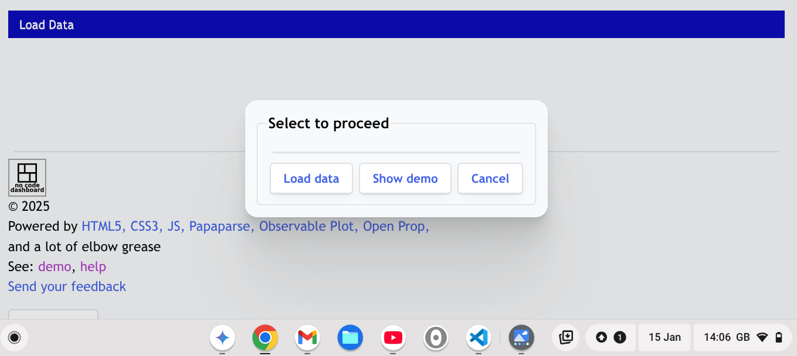
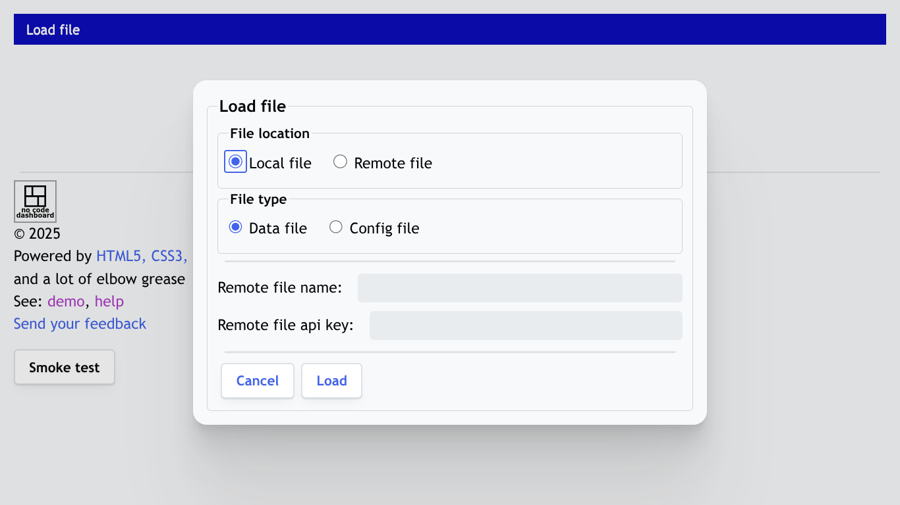

# Data to do

Generate random data for testing. There should be 200 records. Each record will have follwoing information:

1. Region - possible values are US, Europe and Asia
2. Country - a country appropriate to the region
3. Sales amount - number between 10,000 and 1,000,000
4. Sales status - possible values are "sold", "wip", "lost"
5. Client location - possible values are country name

# No-code-dashboard Help

## What is No-code-dashboard?

No-code-dashboard is a web-app designed to **instantly transform raw data into professional quality visual insights**.

The App's process is very simple: you provide a standard CSV file, and it immediately renders your data as a set of callouts and interactive charts.

You can slice and dice the information in these charts to easily perform in-depth analysis. Simply click directly on any bar within a chart to instantly filters all visuals on the screen, allowing you to isolate and focus on specific data segments (e.g., viewing sales data only for a single region or product).

The first dashboard is built in seconds by just loading data. The dashboard can then be easily configured. The App does not any require specialist skills, equipment or software other than an internet connection and the App. It allows the data held in the collaborative tools (such as Jira, DevOps, Service Now, HP/QC, and good old excel) to be the single source of truth. All stakeholders from execs to PMs to developers/testers use same data to make decisions.

The App is based on years of experience of successfully building dashboards to support many projects, large or small.

## How to use the App?

When the App starts up it presents a dialog to select **Load data** or **Show demo** to proceed:

**Load data** allows loading of a data or config file as described [here](#menu-load-file). Once data is loaded the [menu items](#menu-items) show on the top of the screen followed by callouts and charts.

**Show demo** start a pre-prepaired [demos](#what-are-the-demos) to highligh the No-code-dashboard. 

## Menu items 
The main menu on the top of the screen shows the options available.
If no data is loaded it has only [Load file](#menu-load-file) availbale. Once data is loaded the menu options are described below.

### Content 
shows a table-of-content

### Load file 

Load file dialog allows to select local/remote and data/config file as shown below:

If data file is selected the input data is expected as a csv (comma separated value) file. The App expects the date fields to be in DD-MMM-YYYY or YYYY-MM-DD format. This is to avoid misinterpreting American and European date formats. 

When data is loaded first time a config is created automatically which can be modified as described [later](#configure-dashboard). The action by the App depends if data is loaded while a dashbard is already visible: 

|Dashboard with data|Config is applicable|App action|
|---|---|---|
|No|Not relevent|Loads the data and creates a config automatically|
|Yes|Yes|Loads data and uses current config |
|Yes|No|Asks if current config should be used or overwritten and acts as per user feedback |

If config file is selected the input is expected to be json preferably previously [saved](#menu-save-config) by the App. If data is loaded while an existing dashboard is displayed the App checks if the current config is applicable (the column names and types match) to the data being loaded.   

|Config with remote data|Data present|App action|
|---|---|---|
|Yes|Don't care|Loads confi and the data referred in the config.  This is useful when a dashboard has been authoured for distribution to others |
|No|No|Stores config for a subsequent data load|
|No|Yes|Asks if the config should be used to redraw the dashboard or not and acts as per user feedback|

### Configure dashboard 
This menu option allows modification to the dashboard layout such report title, report date.  Callouts and charts can be modified as described [later](#how-configure-dashboard).

### Save Config 
allows you to download the current config. You can use the file later. For some reason the download is not working consistently in all browsers. It download is unsuccessful the config is copied to clipboard and the workaround is to open a new text file, paste the config and save the file

### Print 
When selected it creates a PDF version of the dashboard. The print output does not include the interactive elements (menus, buttons etc) of the dashboard on the screen.

In [demo mode](#what-are-the-demos) a list of predefined options are shown between TOC and Print PDF

## How to configure the dashboard 

The dashboard can be modified in three ways:

|Dashboad component|Details|
|---|---|
|[Layout](#menu-configure-dashboard)|Modify dashboard layout such report title, report date.|
|[Charts](#how-to-configure-charts)||
|Callouts|To do|

## What is a Chart menu? 

On the top-right corner of every chart there is a hamburger menu. When you click on this the App will offer following options:

| Menu option  | Description                                                                                                                                                                                          |
| ---------------------- | ---------------------------------------------------------------------------------------------------------------------------------------------------------------------------------------------------- |
| Filter Chart | This shows all the values in the x-axis where you can select the values that you want filtered: check to show and uncheck to hide. Note this option is only shown for the charts that are filterable |
| [Config Chart](#how-to-configure-charts) | This option gives you the option to change the chart as you see fit.This is described in detail in a separate section                                                                                |
| Remove Chart | deletes the chart. The App asks for a confirmation from you before deleting chart                                                                                                                    |
| Clone Chart  | lets you add a copy of the chart at the current position. Once copied you can change the config                                                                                                      |
| Close        | closes the dialogue                                                                                                                                                                                  |

## How to configure charts? 

On the top-right corner of every chart there is a hamburger menu. When you click on this the App will offer options including one to to configure the chart; all available options are described [here](#what-is-a-chart-menu").

When the **Config chart** is clicked the App shows a dialog with the chart attributes.  Top of the dialog shows the common attributes for all charts.  Following the common attributes chart specific attributes are displayed. A dialog for [bar chart](#chart-type-bar) is shown below:

The common attributes are described below
| Common Attributes|Description|
 ---- |----|
 | Chart title | Lets you change the title of a chart. If left blank the placeholder shows the default title. It is recommended that you keep this blank while you are configuring the charts. Once you are done, you enter a title if you prefer to override the default. |
| Chart size | This can be `small/medium/large`. On larger screens, such as PC or laptop, the three types will show appropriately. On a smaller screen, such as mobile, all charts will show in one size|
| Chart position    | Allows you to re-position a chart. Select a new position and the App move that particular chart to the desired position|
| Chart type | Select a chart type and the App will trfresh the chart specific attributes for possible modifications.  See the table below for a summary on the chart types|

The configurable attributes are dependent on the **Chart type**. A summary of all **Chart type**s are shown below; click on the chart type in the first column to see the chart specific attributes 

|Chart type|Description|
|---|---|
|[2x2 ](#chart-type-2x2)|This chart shows the cross tabulated data for two columns.|
|[Data Description](#chart-type-data-description) |describes that input data, i.e. type of data, counts, man and min values|
|[Data Table](#chart-type-data-table) |This display lists the rows of the input data.|
|[Bar](#chart-type-bar)|This is column chart perhaps the most familier chart type.|
|[Note](#chart-type-note)| allows to specify a message in the dashboard. It is not a chart but useful in embedding key messages in the dashboard. The demos make use of these to describe the charts|
|[Plan](#chart-type-plan) |This shows the data as a Gantt chart.|
|[Risk](#chart-type-risk) |This chart displays data in standard 5x5 risk matrix.|
|[State Change](#chart-type-state-change) |This chart shows data on transition times between different states.|
|[Trend](#chart-type-trend) |This shows trend of values; for example, test execution trend.|
|[Trend OC](#chart-type-trend-oc)| This chart is very similar to **Trend** except it calculates the trend using open and close dates.|

## Chart type: 2x2 

This chart shows the cross tabulated data for two columns. You can select the x and y axes. There is an option of average/sum and count if.  The chart specific attributes are as follows:

|Attribute|Description|
|---|---|
|Horizontal axis|
|Column  name| Specifies the column that is used as the horizontal axis. Data I type is assumed string|
|Order||
|Axis title| this will be the label for the axis in the chart if left blank column name is used|
|Vertical axis|
|Column  name| Specifies the column that is used as the axis. Data I type is assumed string|
|Order||
|Axis title| this will be the label for the vertical axis in the chart if left blank column name is used|
|Chart filter| See [here](#chart-filter) for deatils|
|Count type|See [here](#count-type) for deatils|

## Chart type: Bar 

This is same as column chart, perhaps the most familier chart type. 

There is an option of average/sum and count if as described in the next section. List Count is useful when a column contains a list of values, for example list of tags or list of linked defects to a test script. You have to indicate a separator for the list, such as comma. The separator defaults to a space if not provided. There is an option count if as described in the next section. List Members is useful when a column contains a list of values as described above. The chart shows the count of tags in the input. You can further define count if value as described in the next section

The chart specific attributes are as follows:

|Attribute|Description|
|---|---|
|Column  name|Column  name. Specifies the column that is used as the horizontal axis.|
|Data type| This can be date/number/string/list/ and it specifies how the data is aggregated. These data types are explained later|
|Axis title| this will be the label for the horizontal axis in the chart if left blank no label will be shown which makes the chart more compact|
|Chart filter| See [here](#chart-filter) for deatils|
|Count type|See [here](#count-type) for deatils|

The data types cab as follows:

| Data type| Description|
| --------- | ---- |
| Date      | Date is used when the x-axis has date values. Choose the data table chart type date means the x-axis state at the column ID. You can select the column to show in the x-axis. Different formats available such as `DD` (day of the month, e.g. 01, 02... 31), `DDD` (day of the week, e.g. Mon, Tue... Sun), `MMM` (short month, e.g. Jan, Feb... Dec), `MMM-YY` (specific month in a year, e.g. Jan-25), Wx (weeks from report date) and `Days Elapsed/Days Bussiness` (age in days from report date). |
| Number    | Number is used when the x-axis has numbers. There is an option for youth enter `bin` to show chart by bin values. The bin if entered must be a comma separated list of numbers in ascending order. 
| String    | String is a is used when the axis is a string.  You can define an `Axis labels` that will make sure the axis will be ordered accordingly. For example if "Build, Test, Deploy" is entered for `Axis labels` the axis will show these labels in that ordred followed by any other labels present in data. `Axis labels` is also useful to show specific data even if the value is absent in data. For instance, you want to show P1 even if zero then enter "P1" in `Axis labels`. |
|List|TBD|

## Chart type: Data table 
This display lists the rows of the input data. You can select the number of rows to display.

The chart specific attributes are as follows:

|Attribute|Description|
|---|---|
|To do|To do|

## Chart type: Data description 
This chart describes the input data, i.e. type of data, counts, man and min values. 

The chart specific attributes are as follows:

|Attribute|Description|
|---|---|
|To do|To do|

## Chart type: Note 
**Note** allows to specify a message in the dashboard. It is not a chart but very useful in embedding key messages in the dashboard. The [demos](#what-are-the-demos) make use of these to describe the charts.

The chart specific attributes are as follows:

|Attribute|Description|
|---|---|
|Message|Markdown input to be shown in the chart |

## Chart type: Plan 

This shows the data as a Gantt chart.  The inputs required are column that has the description to show in the plan, cowman for start date and column for the end date. Columns for start and end dates must contain dates. You can further define count if as described in the next section. The chart specific attributes are as follows:

|Attribute|Description|
|---|---|
|Description column |column to contain the description of the activity|
|First set of dates||
|Start date column| column to contain the start date of the activity|
|End date column| column to contain the end date of the activity|
|Second set of dates (optional)|
|Start date column| column to contain the start date of the activity|
|End date column| column to contain the end date of the activity|
|Label| describes how second set of dates will be labeled, defaults to `Actuals`
|RAG (optional)||
|RAG column|Column that shows where the data for rag colour should be picked up|
|RAG map|**Describe the map**|
|Chart filter| See [here](#chart-filter) for deatils|
|Annotatons| See [here](#annotations-) for deatils|

## Chart type: Risk 

This chart displays data in standard 5x5 risk matrix. You can select the likelihood and impact columns. The App will expect the values 1 to 5 in these columns. You can define the likelihood and impact values as well. There are options of average/sum and count if as described in the next section. The chart specific attributes are as follows:

|Attribute|Description|
|---|---|
|To do|To do|

## Chart type: Sate change 

This chart shows data on transition times between different states. It expects that the data source is sorted in acceding order for each item. You have to select the columns from where the App picks the values: Time stamp shows the time of the transition while From and To give the values at the point of transition. There is an option to count the number of transition or calculate the total time of transition or average time for transition. There is also an option of count if as described in the next section. The chart specific attributes are as follows:

|Attribute|Description|
|---|---|
|To do|To do|

## Chart type: Trend 
This shows trend of values; for example, test execution trend. You have to specify a date column. You can further define count if, plan and forecast values as described in the next section. The chart specific attributes are as follows:

|Attribute|Description|
|---|---|
|Horizontal axis||
|Column  name|Specifies the column that is used as the horizontal axis. Data I type I must be date|
|Axis label |this will be the label for the horizontal axis in the chart if left blank column name is used| 
|chart filter||
|plan||
|forecast||
|annotations| see later|

## Chart type: Trend OC 
This chart is very similar to **Trend** except it calculates the trend using open and close dates. The chart specific attributes are as follows:

|Attribute|Description|
|---|---|
|To do|To do|The chart specific attributes are as follows:

|Attribute|Description|
|---|---|
|To do|To do|

## How to set average/sum, chart filter, plan and forecast?

Following parameters are set using string as an input. To aid your input, a template is displayed when the input field is first clicked. The templates are explained below (where _x_ is shown in the template, a value must be provided).

| Attribute    | Description                                                                                                                                                                                                                                                                                                                                                                                                                                                                                                                                                                                                        |
| ------------ | ------------------------------------------------------------------------------------------------------------------------------------------------------------------------------------------------------------------------------------------------------------------------------------------------------------------------------------------------------------------------------------------------------------------------------------------------------------------------------------------------------------------------------------------------------------------------------------------------------------------ |
| Count        | This allows different aggregation menthod - count, sum or average                                                                                                                                                                                                                                                                                                                                                                                                                                                                                                                                                  |
| Chart filter | Chart filter has the template action: exclude oe include, column-name: column, op: eq/neq, operand: value/[array of values] The template means either exclude or include records where the column-name field contains any item in the array.                                                                                                                                                                                                                                                                                                                                                                       |
| Plan         | Plan has the template start: date, end: date, scope-from number, scope-to: max/number, points: line/sigmoid/ [number array] The app draws that from start to end going form scope-from to scope to using the points. The point _arraynum_ a numeric ascending array with max value of 1. Examples: [0, 1] draws a straight line. [0, .2, 1] draws the plan using three values, scope-from at the first point, scope-to as the last point and .2 times (scope-to minus scope-from) in the middle.                                                                                                                   |
| Forecast     | Forecast has two templates. For Chart Type as Trend the template is look-back: number, forecast-to: max/date/number The look-back indicates the number of days previous to the report date used to calculate forecast, forecast-to indicates the end point of the forecast; max means date till the maximum value is reached, date indicates the end date for the forecast, number means a date that is ...Forecast for Trend OC has the template is look-back: number, forecast-to: max/date/number The meaning of most parameters are as above except open and close that indicate how the forecast is modified. |

Each of the common elements are detailed below:

### Count type 

Average/sum where the App uses another column, called column over, that contains numeric data. The App displays the sum or average of the values form this second column.  This is used in [Bar](#chart-type-bar), [Plan](#chart-type-plan), [Trend](#chart-type-trend) and [Trend OC](#chart-type-trend-oc),

### Chart Filter 

Chart filter decides which input records are included. The filter is decided by an array of compares joined by `and/or`. Following are the config items for each compare:
|Config item|Description|
|---|---|
|Relational operator| Possible values are `and/or`. This decides how the row is connected to the previous row. The value in first row is ingoned |
|LHS| Left hand side of the compare, it is alawys a column and at run time the column's content is used|
|Logical operator| Possible values are `eq/neq/in/nin`.|
|RHS|Right hand side of the compare.|

### Plan 

The app draws a line from **Start date** to **End date** starting from **Scope-from** to **Scope-to**. The trajectory of the line is decided by **Points** as decribed below:
|Attribute|Description|
|---|---|
|Start date| Start date of the plan|
|End date| End date of the plan|
|Scope-from| Start numder for the plan, defaults to zero,|
|Scope-to| The end number for the plan. This can be `Max` (instead of a number) in which case the maximum vertical axis value in the chart is used. |
|Points| The values can be `Line/Sigmoid` or array of number that decides the points plotted. `Line`is selected the App draws a staight line; if `Sigmoid` is selected then a curve that increases slowly at the start and end with a period of a rapid rise in between is drwan. When an array of number is provided then the curve is drawn using the formula nth point equals **Scope-from** plus (**Scope-to** minus **Scope-from**) times nth array value. For example `[0, 1]` draws a straight line from 0 to **Scope-to**.|

### Forecast 

Forecast has two templates. For Chart Type as Trend the template is look-back: number, forecast-to: max/date/number The look-back indicates the number of days previous to the report date used to calculate forecast, forecast-to indicates the end point of the forecast; max means date till the maximum value is reached, date indicates the end date for the forecast, number means a date that is ...Forecast for Trend OC has the template is look-back: number, forecast-to: max/date/number The meaning of most parameters are as above except open and close that indicate how the forecast is modified.

## What are the demos? <a id="what-are-the-demos">

The demos are based on years of experience of successfully delivering many types of projects, some $100m in size. The principles learnt from this experience is embedded in the demos thereby significantly improving the value of these demo dashboards to you.
